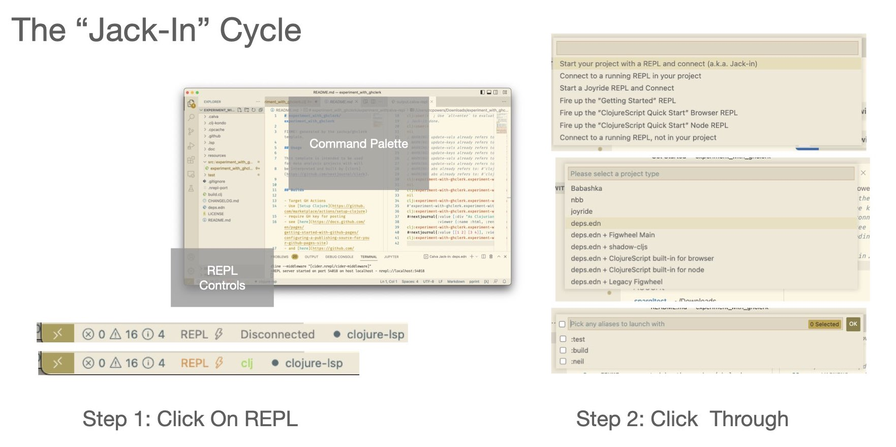
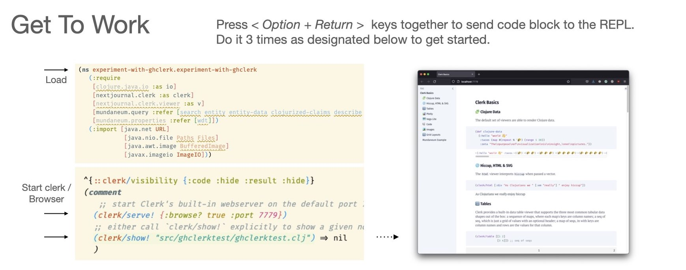

# zachcp/ghclerk

A template to get started with clojure. Features building with `clerk` and deploying of static sites with `GitHub`.

## Usage

The easiest way to use this template is if you have clojure and neil installed.

```sh
# install system dependencies and optional editor
brew install clojure neil
brew install --cask visual-studio-code

# create a new repo. try: neil new help
#
# for a new repo called `ghclerktest`
neil new zachcp/ghclerk ghclerktest \
    --local/root "/Users/zcpowers/Documents/Projects/ghclerktemplate" 

# open editor in your new templated repo
cd ghclerktest && code .
```


## Suggested Usage





