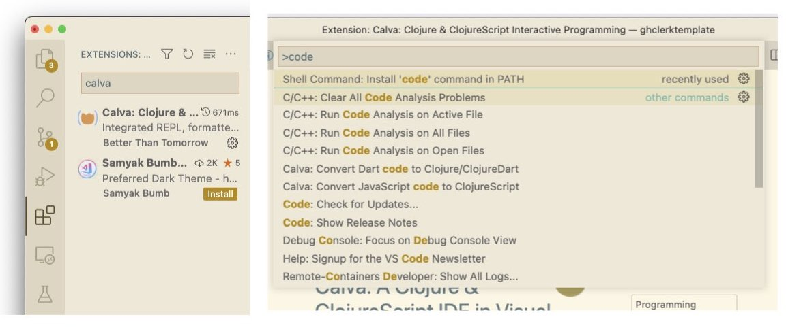

# zachcp/ghclerk

A template to get started with clojure. Features building with `clerk` and deploying of static sites with `GitHub`.

## Usage

The easiest way to use this template is if you have clojure and neil installed.

```sh
# install system dependencies and optional editor
brew install clojure neil
brew install --cask visual-studio-code

# create a new repo. try: `neil new help`
# for a new repo called `ghclerktest`
neil new  zachcp/ghclerk ghclerktest \
    --url https://github.com/zachcp/ghclerk \
    --latest-sha


# open editor in your new templated repo
cd ghclerktest && code .

# follow the suggestions above/below to:
#  1. install VScode/Calva 
#  2. start and "jack-in" to a Clojure REPL
#  3. send code to the REPL and watch in evaluate
```


### VSCode + Calva



### Starting the REPL


### Geting Started


## Deploying

If you push your new repository to Github the Github Actions system will be configured to build and push any `clj` namespaces as a clerk notebook. However, you do need to give the Github Actions system authorization to use Github Pages.

